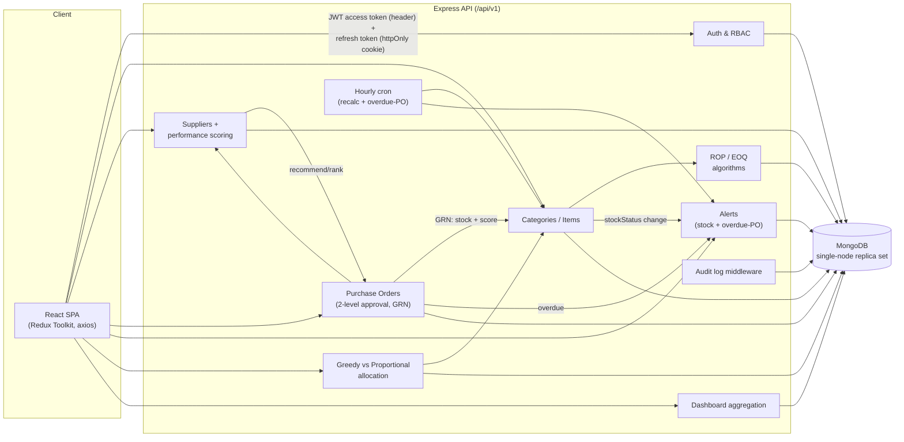
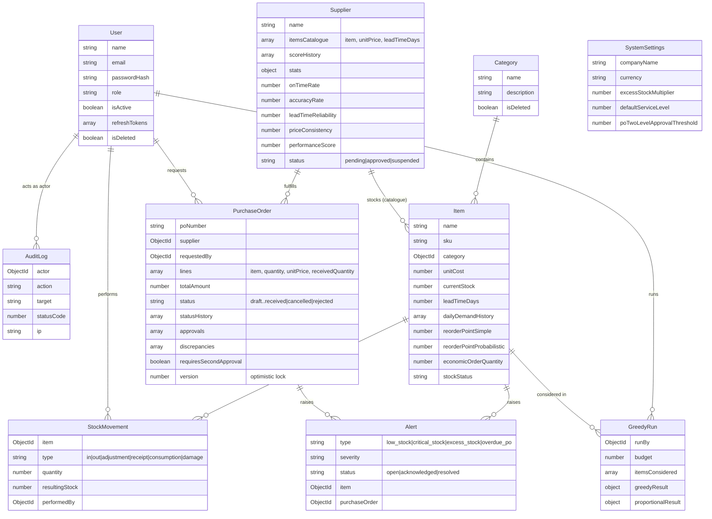

# Inventory & Supply Chain Management System

Web-based Inventory & Supply Chain Management System (MERN + planned ADK agent layer) — UWS MSc group project, SCQF Level 11. This README covers **Phase 1 (Secure Platform + Live Inventory Core)** and **Phase 2 (Suppliers, Purchase Orders, Greedy Allocation)**.

- `backend/` — Express/MongoDB API: auth & RBAC, audit log, system settings, categories/items with ROP/EOQ, dashboard aggregation, suppliers with performance scoring, the full purchase order lifecycle with GRN, alerts, and the Greedy vs Proportional budget allocator. See `backend/README.md`.
- `frontend/` — React/Vite app: auth flow, dashboard, inventory/category management, admin pages, supplier/PO management, ROP/EOQ calculator, greedy allocation & comparison pages, notification bell. See `frontend/README.md`.
- `agents/` — Gemini-backed ADK agents (Monitoring, Advisory, Analytics, Procurement) that call the API over HTTP as authenticated service accounts. See `backend/README.md#adk-agents-agents-and-the-agent-to-api-auth-flow`.

## Quick start (Docker)

```bash
docker compose up
```

Boots the API (`:5000`) and a single-node MongoDB replica set together (replica set is required for the API's multi-document transactions). Then, in the `backend/` folder, seed real data:

```bash
cd backend
npm install             # local deps, for running the seed script against the Docker Mongo
npm run seed:download  # fetches the DataCo dataset CSV (~95MB, gitignored)
npm run seed            # seeds 5 categories / 50 real items / demand history + a Super Admin login
npm run seed:suppliers # seeds suppliers + purchase orders against those items
```

Then start the frontend separately (Docker Compose here only runs the API + Mongo):

```bash
cd frontend
npm install
npm run dev             # http://localhost:5173
```

Swagger docs: `http://localhost:5000/api/docs`. Seeded Super Admin login: `admin@example.com` / `ChangeMe123!` (from `backend/.env.example` — override via `SEED_ADMIN_EMAIL`/`SEED_ADMIN_PASSWORD`).

`docker compose up` also starts the `agents` service on `:4000`, but it needs a `GEMINI_API_KEY` and the two service-account passwords to do anything useful — set `GEMINI_API_KEY`, `AGENTS_READONLY_PASSWORD`, and `AGENTS_PROCUREMENT_PASSWORD` in a `.env` file at the repo root (docker-compose.yml reads them from there) before bringing it up, and run `npm run seed:agents` in `backend/` first so those two accounts actually exist to log in as.

## Quick start (without Docker)

Run MongoDB yourself as a single-node replica set, point `backend/.env`'s `MONGODB_URI` at it, then run `npm run dev` in both `backend/` and `frontend/` as above.

To also run the agents service locally: `cd backend && npm run seed:agents` first (creates the two service-account logins, printing their generated passwords once), copy `agents/.env.example` to `agents/.env`, fill in `GEMINI_API_KEY` and those two passwords (`API_BASE_URL` should point at `http://localhost:5000/api/v1` outside Docker), then:

```bash
cd agents
npm install
npm run dev             # http://localhost:4000
```

## Team & phase status

Team ownership and engineering standards are documented in the project briefs (not in this repo). At a glance:

**Phase 1** delivers:
- Real JWT auth (rotating refresh tokens, httpOnly cookie) with 4 roles enforced server-side
- Category/Item CRUD with automatic ROP (simple + probabilistic) and EOQ (Wilson formula) recalculation
- Transactional stock movements, an hourly recalculation cron, and a live dashboard
- Swagger docs, an audit log, ≥80% test coverage on `backend/src/services/**`, and a seed script driven by the real DataCo Smart Supply Chain dataset

**Phase 2** delivers:
- Supplier CRUD, item catalogue (price/lead time), a four-metric performance score (on-time rate, accuracy, lead-time reliability, price consistency), approve/suspend status, and greedy supplier recommendation
- The full purchase order lifecycle - draft → submitted → approved/rejected → sent → shipped → partially/fully received → cancelled - with two-level approval above a configurable value threshold and optimistic locking (`version` field) on every transition
- Goods receipt (GRN) with under/over-delivery discrepancy detection, atomic stock update + alert resolution + supplier score recalculation in a single Mongo transaction
- Low/critical/excess-stock alerts kept in sync automatically on every item save, plus an hourly overdue-PO cron; a notification bell in the UI
- Greedy (urgency-ranked) vs Proportional (water-filling) budget allocation, run against real low-stock items, compared side by side and saved to history
- A client-side ROP/EOQ what-if calculator with a live 7x7 EOQ sensitivity heatmap

## Architecture



## MongoDB schema (Phase 1 + Phase 2)


