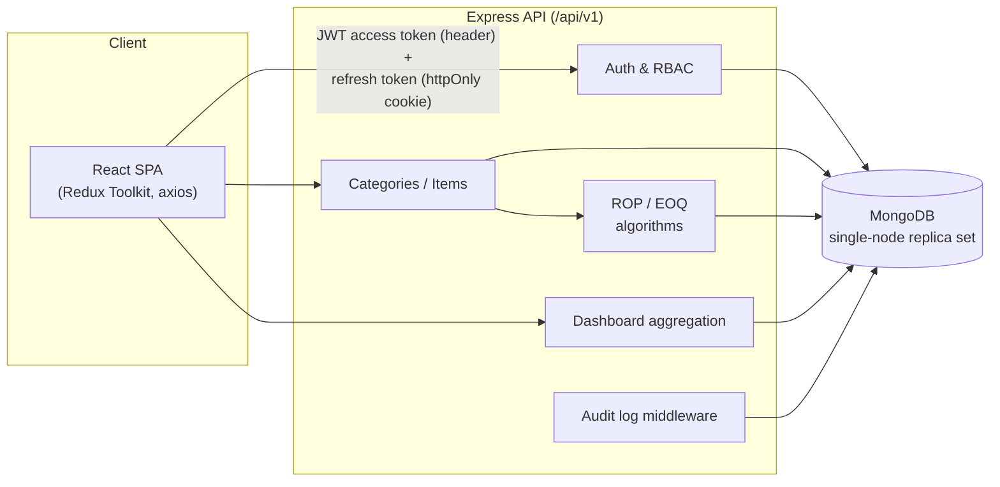
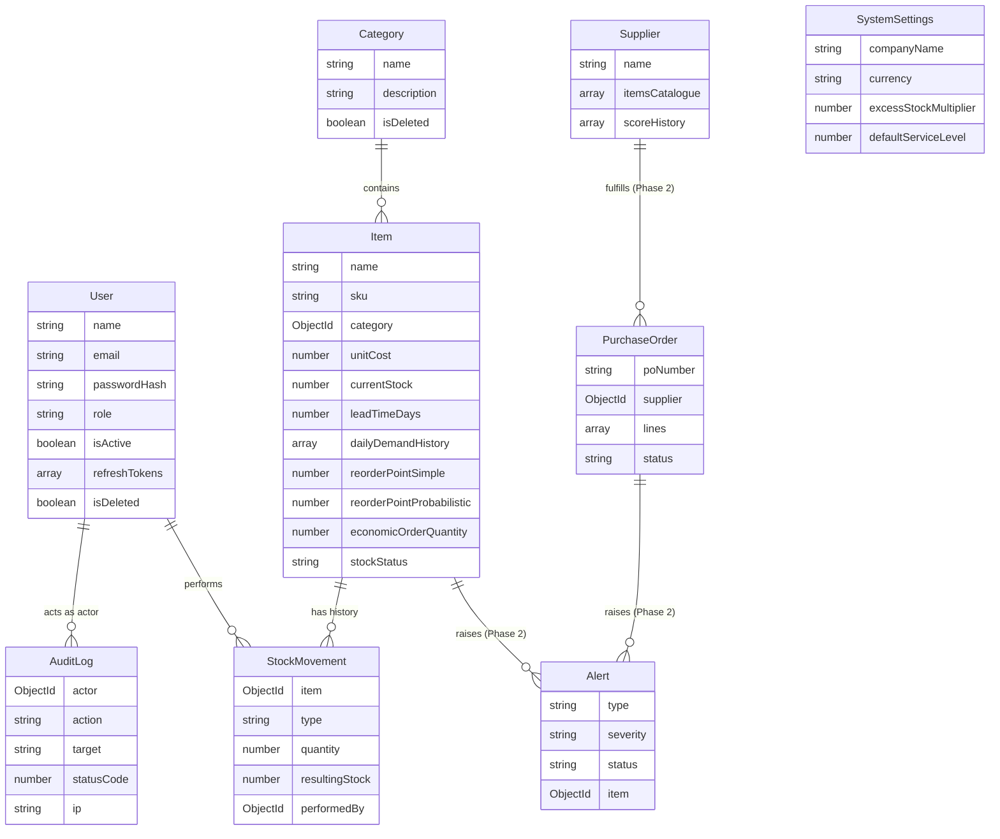

# Inventory & Supply Chain Management System

Web-based Inventory & Supply Chain Management System (MERN + planned ADK agent layer) — UWS MSc group project, SCQF Level 11. This README covers **Phase 1: Secure Platform + Live Inventory Core**.

- `backend/` — Express/MongoDB API: auth & RBAC, audit log, system settings, categories/items with ROP/EOQ, dashboard aggregation. See `backend/README.md`.
- `frontend/` — React/Vite app: auth flow, dashboard, inventory/category management, admin pages. See `frontend/README.md`.

## Quick start (Docker)

```bash
docker compose up
```

Boots the API (`:5000`) and a single-node MongoDB replica set together (replica set is required for the API's multi-document transactions). Then, in the `backend/` folder, seed real data:

```bash
cd backend
npm install            # local deps, for running the seed script against the Docker Mongo
npm run seed:download  # fetches the DataCo dataset CSV (~95MB, gitignored)
npm run seed            # seeds 5 categories / 50 real items / demand history + a Super Admin login
```

Then start the frontend separately (Docker Compose here only runs the API + Mongo):

```bash
cd frontend
npm install
npm run dev             # http://localhost:5173
```

Swagger docs: `http://localhost:5000/api/docs`. Seeded Super Admin login: `admin@example.com` / `ChangeMe123!` (from `backend/.env.example` — override via `SEED_ADMIN_EMAIL`/`SEED_ADMIN_PASSWORD`).

## Quick start (without Docker)

Run MongoDB yourself as a single-node replica set, point `backend/.env`'s `MONGODB_URI` at it, then run `npm run dev` in both `backend/` and `frontend/` as above.

## Team & phase status

Team ownership, engineering standards, and the Phase 1 Definition of Done are documented in the Phase 1 project brief (not in this repo). At a glance, this phase delivers:

- Real JWT auth (rotating refresh tokens, httpOnly cookie) with 4 roles enforced server-side
- Category/Item CRUD with automatic ROP (simple + probabilistic) and EOQ (Wilson formula) recalculation
- Transactional stock movements, a nightly recalculation cron, and a live dashboard
- `Supplier`/`PurchaseOrder`/`Alert` schemas as a reviewed Phase 2 lookahead (no API yet)
- Swagger docs, an audit log, ≥80% test coverage on `backend/src/services/**`, and a seed script driven by the real DataCo Smart Supply Chain dataset

## Architecture



## MongoDB schema (Phase 1)



`Supplier`, `PurchaseOrder`, and `Alert` are schema-only in Phase 1 (Member 3 lookahead) — no routes/controllers consume them yet.
